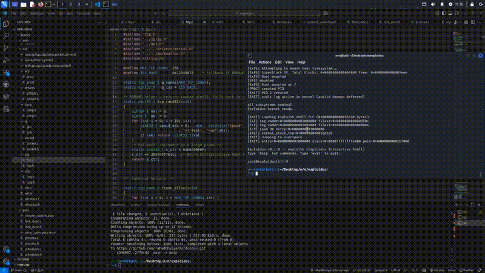

# Exploidus — Reactive Capability Kernel

A custom x86-64 operating system kernel built from scratch.

## Demo

**Features:**
- Multiboot2 boot via GRUB2
- 4-level x86-64 paging with NX enforcement
- Colored zone physical memory manager (GREEN / YELLOW / RED)
- BLAKE3 capability token system with RDRAND seeding
- Intent-based preemptive scheduler (5 priority classes)
- Blocking waitpid (no busy-spin)
- VFS + ExFS filesystem with provenance records
- TCP/IP network stack (e1000, ARP, IP fragment reassembly, TCP, UDP, ICMP)
- 58 syscalls fully implemented (open/close/mmap/munmap/ps/audit/net)
- exploish interactive shell with real ps and audit commands

---

## Requirements

- Kali Linux (WSL2 on Windows, or native)
- x86_64-elf cross-compiler — built automatically by setup.sh
- NASM assembler
- QEMU x86_64 emulator
- xorriso + GRUB (for ISO builds)
- ~4 GB free disk space
- ~45 minutes first-time build (cross-compiler takes ~30 min)

---

## Quick Start (Kali Linux / WSL2)

    # Step 1: Install system packages
    sudo apt update
    sudo apt install -y build-essential nasm qemu-system-x86 xorriso \
                       grub-pc-bin grub-common mtools curl

    # Step 2: Build cross-compiler (once, takes ~30 min)
    bash setup.sh

    # Step 3: Reload PATH
    source ~/.bashrc

    # Step 4: Build kernel
    make

    # Step 5: Run (disk + network attached, so /bin/rahu works)
    make qemu-disk

You will see the kernel boot and the exploish shell appear. Plain
`make qemu` also works and boots faster, but it has no disk attached —
/bin only contains what's embedded in the kernel image, so rahu and
hello won't be there. Use `qemu-disk`/`qemu-gui`/`qemu-run` whenever you
need a working /bin or networking.

---

## Run Options

`qemu`, `qemu-vga` and `qemu-iso` boot the kernel with no disk attached —
fine for testing the kernel/shell core, but /bin/rahu and /bin/hello
won't exist. The `-disk`/`-gui`/`-run` targets mount build/disk.img and
enable the e1000 NIC, so the full system (including rahu) is available.

### Serial output in terminal, no disk
    make qemu
All output goes to your terminal. Type commands here.

### VGA window, no disk (needs WSLg or X server)
    make qemu-vga
Opens a QEMU window with VGA text display.

### Full system: disk + network, terminal output (recommended for rahu)
    make qemu-disk
Mounts build/disk.img and enables networking, so /bin/rahu, /bin/hello
etc. are present and `rahu install` can reach the registry at
10.0.2.2:9090. Serial output goes to your terminal.

### Full system with a VGA window
    make qemu-gui
Same as qemu-disk, but also opens a VGA window alongside the serial output.

### Full system, GUI + serial log to file
    make qemu-run
Same as qemu-gui, but serial output is written to /tmp/serial.log instead
of your terminal — use `tail -f /tmp/serial.log` to follow it.

### Bootable ISO (no disk)
    make iso
    qemu-system-x86_64 -cdrom build/exploidus.iso -m 256M -serial stdio -display none

### GDB debugging
Terminal 1:
    make debug

Terminal 2:
    gdb build/exploidus.elf
    (gdb) target remote :1234
    (gdb) break kernel_main
    (gdb) continue

---

## Shell Commands

    help            List all commands
    ps              Show running processes (real kernel data)
    audit           Show audit log entries
    pid             Show current PID
    uname           Kernel version
    echo <text>     Print text
    clear           Clear screen
    cap             Show capability info
    rahu install    Install package (downloads from registry)
    rahu remove     Remove package (stub — not yet implemented)
    rahu list       List installed packages (stub — use 'ls /bin')
    rahu search     Search local package index
    rahu update     Refresh local package index
    exit [code]     Exit

---

## Project Structure

    exploidus/
    kernel/arch/x86_64/    GDT, IDT, IRQ, ISR stubs
    kernel/boot/           Multiboot2 entry, long mode
    kernel/mm/             PMM, VMM, kmalloc
    kernel/cap/            BLAKE3 capability tokens
    kernel/audit/          Ring-buffer audit log
    kernel/proc/           Process table, scheduler, fork/exec
    kernel/syscall/        58 syscalls
    kernel/drivers/        VGA, serial, keyboard, ATA
    kernel/fs/vfs/         Virtual filesystem
    kernel/fs/exfs/        ExFS + provenance
    kernel/elf/            ELF64 loader
    kernel/net/            TCP/IP stack
    userspace/libc/        syscall wrappers, crt0
    userspace/shell/       exploish shell
    linker.ld              Kernel linker script
    Makefile               Build system
    setup.sh               Cross-compiler installer

---

## Build Targets

    make           Build kernel + shell
    make clean     Remove build artifacts
    make iso       Build bootable ISO
    make qemu      Run (serial, no window, no disk)
    make qemu-vga  Run with VGA window (no disk)
    make qemu-disk Run with disk + network attached (rahu works)
    make qemu-gui  Same as qemu-disk, with a VGA window
    make qemu-run  Same as qemu-gui, serial output logged to a file
    make debug     Run with GDB on :1234

---

## Troubleshooting

x86_64-elf-gcc not found:
    source ~/.bashrc
    # or:
    export PATH="$HOME/opt/cross/bin:$PATH"

QEMU blank screen:
    Use make qemu (serial mode), not make qemu-vga unless WSLg is available.

Build fails:
    make clean && make

WSL2 no GUI window:
    Use make qemu — no window needed for serial output.

## Author Rahad Bhuiya

## License MIT