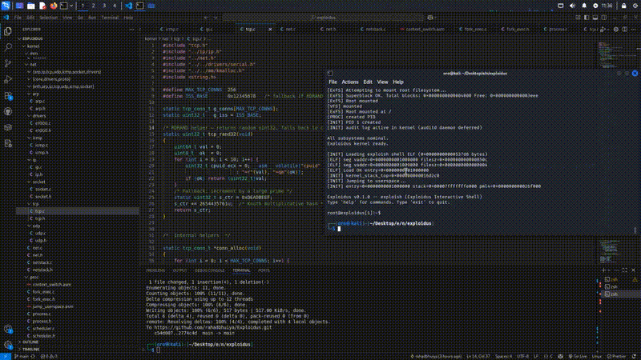

# Exploidus — Reactive Capability Kernel

A custom x86-64 operating system kernel built from scratch.

## About

Exploidus is a personal operating system project developed in Bangladesh for operating system research and education.
The project is built from scratch and continues to evolve with new kernel subsystems, userspace applications, networking, and graphics support.
To the best of the author's knowledge, Exploidus is among the earliest publicly documented from-scratch operating system projects developed in Bangladesh. If you are aware of an earlier publicly documented project, please open an issue with supporting evidence.

## Demo

**Features:**
- Multiboot2 boot via GRUB2
- 4-level x86-64 paging with NX enforcement
- Colored zone physical memory manager (GREEN / YELLOW / RED)
- BLAKE3 capability token system with RDRAND seeding
- Intent-based preemptive scheduler (5 priority classes)
- Blocking waitpid (no busy-spin)
- Crash isolation — a fault in a userspace process kills only that
  process; the kernel keeps running (kernel-mode faults still halt)
- Kernel synchronization primitives: IRQ-safe spinlocks, blocking
  mutexes/semaphores (kernel/sync/)
- Additive driver registry (kernel/drivers/driver.c) tracking every
  hardware driver initialized at boot
- VFS + ExFS filesystem with provenance records
- Generic block-device abstraction (kernel/drivers/blockdev.c) — ATA
  and USB mass-storage both register as named block devices (`ata0`,
  `usb0`); filesystem code goes through this interface instead of
  calling a specific driver directly
- USB stack: UHCI host controller driver (kernel/usb/uhci.c) — PCI
  detection, control/interrupt/bulk transfers, full device
  enumeration, HID reports, and USB Mass Storage (Bulk-Only
  Transport + SCSI READ/WRITE) with a `mount` shell command to attach
  a USB stick's ExFS volume into the VFS
- TCP/IP network stack (e1000, ARP, IP fragment reassembly, TCP, UDP, ICMP)
- 82 syscalls fully implemented (open/close/mmap/munmap/ps/audit/net/fb_blit/sigaction/chmod/rmdir/rtc/futex/tls/mount)
- exploish interactive shell with real ps and audit commands
- Userspace compositor (`alien` command) with double-buffered
  rendering, dirty-region-aware redraws, single-syscall window
  blitting (SYS_FB_BLIT), and real-time-paced frame pacing

---

## Requirements

- Kali Linux (WSL2 on Windows, or native)
- x86_64-elf cross-compiler — built automatically by setup.sh
- NASM assembler
- QEMU x86_64 emulator
- xorriso + GRUB (for ISO builds)
- ~4 GB free disk space
- ~45 minutes first-time build (cross-compiler takes ~30 min)

---

## Quick Start (Kali Linux / WSL2)

    # Step 1: Install system packages
    sudo apt update
    sudo apt install -y build-essential nasm qemu-system-x86 xorriso \
                       grub-pc-bin grub-common mtools curl

    # Step 2: Build cross-compiler (once, takes ~30 min)
    bash setup.sh

    # Step 3: Reload PATH
    source ~/.bashrc

    # Step 4: Build kernel
    make

    # Step 5: Run (disk + network attached, so /bin/rahu works)
    make qemu-disk

You will see the kernel boot and the exploish shell appear. Plain
`make qemu` also works and boots faster, but it has no disk attached —
/bin only contains what's embedded in the kernel image, so rahu and
hello won't be there. Use `qemu-disk`/`qemu-gui`/`qemu-run` whenever you
need a working /bin or networking.

---

## Run Options

`qemu`, `qemu-vga` and `qemu-iso` boot the kernel with no disk attached —
fine for testing the kernel/shell core, but /bin/rahu and /bin/hello
won't exist. The `-disk`/`-gui`/`-run` targets mount build/disk.img and
enable the e1000 NIC, so the full system (including rahu) is available.

### Serial output in terminal, no disk
    make qemu
All output goes to your terminal. Type commands here.

### VGA window, no disk (needs WSLg or X server)
    make qemu-vga
Opens a QEMU window with VGA text display.

### Full system: disk + network, terminal output (recommended for rahu)
    make qemu-disk
Mounts build/disk.img and enables networking, so /bin/rahu, /bin/hello
etc. are present and `rahu install` can reach the registry at
10.0.2.2:9090. Serial output goes to your terminal.

### Full system with a VGA window
    make qemu-gui
Same as qemu-disk, but also opens a VGA window alongside the serial output.

### Full system, GUI + serial log to file
    make qemu-run
Same as qemu-gui, but serial output is written to /tmp/serial.log instead
of your terminal — use `tail -f /tmp/serial.log` to follow it.

### Bootable ISO (no disk)
    make iso
    qemu-system-x86_64 -cdrom build/exploidus.iso -m 256M -serial stdio -display none

### GDB debugging
Terminal 1:
    make debug

Terminal 2:
    gdb build/exploidus.elf
    (gdb) target remote :1234
    (gdb) break kernel_main
    (gdb) continue

---

## Shell Commands

    help            List all commands
    ps              Show running processes (real kernel data)
    audit           Show audit log entries
    pid             Show current PID
    uname           Kernel version
    echo <text>     Print text
    clear           Clear screen
    cap             Show capability info
    rahu install    Install package (downloads from registry)
    rahu remove     Remove package (stub — not yet implemented)
    rahu list       List installed packages (stub — use 'ls /bin')
    rahu search     Search local package index
    rahu update     Refresh local package index
    mount <dev> <mountpoint>   Mount a block device (e.g. mount usb0 /media/usb0)
    exit [code]     Exit

---

## Project Structure

    exploidus/
    kernel/arch/x86_64/    GDT, IDT, IRQ, ISR stubs, crash-isolating fault handler
    kernel/boot/           Multiboot2 entry, long mode
    kernel/mm/             PMM, VMM, kmalloc (spinlock-protected heap)
    kernel/cap/            BLAKE3 capability tokens
    kernel/audit/          Ring-buffer audit log
    kernel/proc/           Process table, scheduler, fork/exec
    kernel/sync/           Spinlock, mutex, semaphore primitives
    kernel/syscall/        82 syscalls
    kernel/drivers/        VGA, serial, keyboard, mouse, ATA, framebuffer,
                           driver.c (hardware driver registry),
                           blockdev.c (generic block-device abstraction)
    kernel/usb/            UHCI host controller driver — control/interrupt/
                           bulk transfers, enumeration, HID, mass storage
    kernel/fs/vfs/         Virtual filesystem
    kernel/fs/exfs/        ExFS + provenance
    kernel/elf/            ELF64 loader
    kernel/net/            TCP/IP stack
    userspace/libc/        syscall wrappers, crt0
    userspace/shell/       exploish shell
    userspace/compositor/  Windowing compositor (`alien` GUI mode)
    linker.ld              Kernel linker script
    Makefile               Build system
    setup.sh               Cross-compiler installer

---

## Build Targets

    make           Build kernel + shell
    make clean     Remove build artifacts
    make iso       Build bootable ISO
    make qemu      Run (serial, no window, no disk)
    make qemu-vga  Run with VGA window (no disk)
    make qemu-disk Run with disk + network attached (rahu works)
    make qemu-usb-storage-test  Run with a USB mass-storage device attached
                   instead of usb-tablet, to exercise the UHCI mass-storage path
    make qemu-gui  Same as qemu-disk, with a VGA window
    make qemu-run  Same as qemu-gui, serial output logged to a file
    make debug     Run with GDB on :1234

---

## Troubleshooting

x86_64-elf-gcc not found:
    source ~/.bashrc
    # or:
    export PATH="$HOME/opt/cross/bin:$PATH"

QEMU blank screen:
    Use make qemu (serial mode), not make qemu-vga unless WSLg is available.

Build fails:
    make clean && make

WSL2 no GUI window:
    Use make qemu — no window needed for serial output.

GUI (`alien`)/mouse feels slow or stuttery:
    All qemu-disk/qemu-gui targets now pass -accel kvm:tcg, which uses
    KVM hardware acceleration when available and falls back to plain
    software emulation (TCG) otherwise. Check whether KVM is actually
    available on your host:
        ls -la /dev/kvm
    If that file doesn't exist, QEMU is running the CPU in pure
    software emulation, which can be dramatically (10-50x) slower than
    real hardware — enough on its own to make interrupt-heavy code
    (mouse polling, the compositor) feel laggy no matter how optimized
    the OS code is. If you're inside a VM (VMware/VirtualBox/cloud),
    enable nested virtualization for the guest (e.g. VMware: VM
    Settings -> Processor -> "Virtualize Intel VT-x/EPT or AMD-V/RVI";
    VirtualBox: Settings -> System -> Processor -> "Enable Nested
    VT-x/AMD-V") and make sure the kvm kernel module is loaded
    (`sudo modprobe kvm_intel` or `kvm_amd`).

## Author Rahad Bhuiya

## License MIT

---

## Recent Stability Fixes

A round of fixes to the GUI/compositor path and kernel core:

- **Mouse cursor race**: the kernel's PS/2 IRQ handler no longer draws
  its own cursor directly on the framebuffer while the compositor owns
  the screen (`fb_console_enabled()` gates it) — it was racing with
  the compositor's double-buffered draw and flip.
- **fb_blend_pixel double-buffer bug**: shadows/blends were being
  written straight to the front buffer, bypassing double buffering,
  which caused visible flicker on every composite.
- **SYS_FB_BLIT**: a new syscall blits a whole window's ARGB buffer in
  one call instead of one syscall per pixel (previously ~120,000
  syscalls per window per frame for a typical window size).
- **composite_frame_light()**: plain cursor movement no longer
  triggers a full wallpaper gradient repaint; only the affected
  windows/dock are redrawn.
- **Software VSync**: the compositor paces repaints against real
  elapsed time (`uptime()`), not a loop-iteration counter, so the
  frame rate stays consistent regardless of other work happening in
  the event loop.
- **Crash isolation**: a fault (page fault, GPF, divide-by-zero, ...)
  in userspace code now kills only that process, the same way
  `sys_exit()` does, instead of halting the entire kernel. Faults in
  kernel-mode code still halt, since kernel state may be corrupted.
- **kmalloc/kfree race**: the heap free-list is now protected by an
  IRQ-safe spinlock — previously an interrupt firing mid-allocation
  could corrupt it.
- **kernel/sync/**: new spinlock/mutex/semaphore primitives for future
  use protecting shared kernel/driver state.
- **Driver registry**: `kernel/drivers/driver.c` tracks every hardware
  driver initialized at boot (additive — boot order is unchanged).
- **Removed hot-path debug logging**: `unblock_sleepers()` (runs from
  the timer IRQ at 100Hz) and `ipc_send()` (runs on every message)
  used to `serial_print()` on every event. Serial writes busy-wait on
  real UART timing, so this was stalling keyboard/mouse/scheduling
  system-wide on every process wake-up or IPC message — likely the
  single biggest contributor to perceived input lag.
- **QEMU acceleration**: `qemu-disk`/`qemu-gui` now pass
  `-accel kvm:tcg`, using KVM hardware acceleration when the host
  supports it (see Troubleshooting if `/dev/kvm` isn't available).

## Native Language-Porting Foundation + Lua 5.5.0

Exploidus now has a real, working **Lua 5.5.0** port (`userspace/lua/`,
run with `lua` from the shell) — the first third-party language
runtime running on the OS. Built entirely on native Exploidus
syscalls, not a Linux compatibility layer (see the syscall ABI
discussion in project history for why). Getting there required a
real libc foundation that mostly didn't exist before:

- `setjmp`/`longjmp` (x86-64 asm), a real `<math.h>` (bit-trick +
  Taylor-series based, no hardware libm dependency), `<errno.h>`,
  `<ctype.h>`, `<assert.h>`, `<locale.h>`, real `<time.h>` (backed by
  a new CMOS RTC driver, `kernel/drivers/rtc.c` — Exploidus had no
  real calendar-time source before, only ticks-since-boot)
- **FPU/SSE support**: userspace couldn't return a `double` at all
  before (`-mno-sse` was set everywhere) — `kernel/arch/x86_64/fpu.c`
  enables SSE and gives every process its own FXSAVE/FXRSTOR state,
  saved/restored on every context switch
- **Native `SYS_SET_TLS`** and **`SYS_FUTEX_WAIT`/`WAKE`** (intra-
  process scope) for anything needing thread-local storage or a
  wait/wake primitive to build synchronization on top of
- A real PMM bug this surfaced: `parse_memory_map()` used a hardcoded
  2MB "safe to allocate" cutoff that didn't account for the kernel's
  own `.bss` (including its 4MB static heap array) extending well
  past that — small test binaries never needed enough pages to hit
  it, but Lua's ~60-page binary did, corrupting live kernel memory.
  Fixed via a real `_kernel_end` linker symbol.
- A second, general bug the Lua port surfaced: **any function pointer
  in an ASLR-relocated binary holds its link-time address, not the
  real runtime one** (the loader shifts binaries without processing
  relocations) — see the dedicated section below.
- **Real signal delivery**: `signal()` now actually works — a
  hardware fault (SIGSEGV/SIGFPE/SIGILL) in a process with a
  registered handler redirects execution there instead of always
  killing the process. One-shot, and the handler must call `exit()`
  itself (no sigreturn/resume support yet).
- **Terminal echo + backspace-editable input**: `kernel_read()` had no
  cooked-mode line editing at all — invisible while typing, and a
  backspace became a literal embedded byte instead of deleting a
  character. Fine for exploish (which does its own full editor) but
  broke any ordinary program reading stdin normally (Lua's REPL,
  `yolish`). New `SYS_TTY_SET_RAW` lets exploish opt out; everyone
  else gets real echo/backspace by default now.

## VFS / Filesystem

- **Permission enforcement**: file mode bits were stored at creation
  but never checked anywhere — any process could read/write any file
  regardless of permissions. `vfs_open()` now actually enforces
  owner read/write bits, and a new `chmod()` syscall lets you set
  them.
- **`rmdir()`**: was entirely missing (only `mkdir` existed). Refuses
  non-empty directories.
- **Write-through block cache**: ExFS did a full 8-sector PIO ATA read
  for every single block access, even ones read moments earlier
  (directory traversal, inode lookups). New 256 KiB write-through
  cache in `exfs_volume_t`.
- Fixed `fopen(path, "w")` never actually creating a new file — it
  never passed `O_CREAT`, so it silently failed on any path that
  didn't already exist. Not specific to any one program; anything
  writing a new file via `fopen()` hit this.

## Networking

- Fixed busy-spin polling (no yield, up to 500 back-to-back retries)
  and a silent stack-buffer-overflow risk in `http_get()`/
  `http_download()`.
- **UDP sockets could never receive any data, ever**: the
  `net_socket(SOCK_UDP)` API's receive ring buffer existed but nothing
  in the whole codebase ever wrote to it — went unnoticed because DNS
  resolution bypasses the socket API via its own direct callback.
  Bridged the two (`socket_udp_recv_cb` in `kernel/net/socket/socket.c`).
- **No loopback interface existed**: `ip4_output()` had no special
  case for `127.0.0.1` (or the interface's own IP) — such packets fell
  through to real ARP+Ethernet+NIC transmission, which can never
  succeed, so they were silently dropped. This broke all localhost
  communication even though the *receiving* side already had
  loopback-accept logic. Now delivers straight to `ip4_input()`
  instead of transmitting, like a real OS's `lo` interface.
- `net_connect()`/`net_recv()`'s TCP "timeout" was a loop-iteration
  count, not real elapsed time (so it didn't reliably mean what it
  claimed to). Converted to a real wall-clock deadline.

## Process / Scheduling

- Per-process CPU time accounting (`ticks_used`) was declared and
  exposed via `ps`'s TICKS column but never actually incremented
  anywhere — `ps` always showed 0. Now wired up in `sched_tick()`,
  plus a CPU% column. Honest caveat: a process idly halted waiting
  for keyboard input (`kernel_read()`'s wait loop) still counts as
  "current" during that halt, so CPU% for an interactive shell reads
  higher than its *actual* work would suggest — this is a real
  scheduler-level idle-vs-running distinction Exploidus doesn't make
  yet, not just a display bug.

## Resolved: function pointers now survive ASLR (real relocation processing + static-PIE)

The loader used to give ET_EXEC binaries ASLR (random load base) by
shifting the whole image without processing ELF relocations — RIP-
relative code self-corrected under a pure shift, but an explicit
function pointer **value** (a signal handler passed to `signal()`, a
static callback table, anything stored as data rather than computed
at the call site) kept its **link-time** (base-0) address instead of
the real runtime one, jumping to the wrong place if called. The old
workaround was linking anything that took a function pointer against
a fixed, non-ASLR'd base (`fixed.ld`) instead.

This is now fixed properly:

- `kernel/elf/elf.c`'s `apply_relocations()` correctly processes
  `R_X86_64_RELATIVE` entries at load time.
- **Every userspace binary migrated from ET_EXEC to static-PIE**
  (`pie.ld` + `PIE_LDFLAGS` in the Makefile) — `shell`, `rahu`, `lua`,
  `compositor`, and everything else now actually exercises the
  relocation path instead of opting out via `fixed.ld`. The old
  fixed-base `.ld` scripts are left in-tree for reference but are no
  longer used.
- ASLR entropy widened (7→8 bits of real 2MB-granularity randomness)
  and the **stack** is now randomized too (previously fixed at
  `USER_STACK_TOP`) — both within the existing safe pd0 user address
  range, no page-table changes needed.
- A real bug this surfaced and fixed: `syscall1()`/`syscall2()`
  (`userspace/libc/syscall.h`) left `rsi`/`rdx` unset for syscalls
  that only logically need one argument (e.g. `spawn(path)`). Under
  the old fixed-address build this happened to be harmless; under PIE
  (different code addresses → different leftover register values)
  `spawn("/bin/lua")`'s stale `rdx` sometimes looked like a valid
  pointer, and `sys_spawn()` reads `rdx` unconditionally to detect an
  optional args string — so garbage leaked into the child's `argv[1]`
  and corrupted Lua's `collectargs()`/`handle_script()`, crashing on
  a bad `strcmp()` pointer. Fixed by explicitly zeroing the unused
  registers in the syscall wrappers.

Remaining honest limitation: 8 bits of ASLR entropy is still weak
compared to a desktop OS (Linux gives 28+) — going further needs
`make_isolated_pml4()` to clear more than one PD table's worth of
user address space, a bigger architectural change not done yet.

## USB stack (UHCI)

`kernel/usb/uhci.c` — PCI class-code detection (not vendor-specific,
finds any UHCI controller), controller reset, and a real transfer
layer built from Transfer Descriptors / Queue Heads:

- **Control transfers**: full device enumeration — partial (8-byte)
  device descriptor, `SET_ADDRESS`, full 18-byte descriptor via
  multi-packet chaining, configuration descriptor parsing (interface
  class/endpoints), `SET_CONFIGURATION`.
- **Interrupt transfers**: HID report reads (verified against a QEMU
  `usb-tablet`), correctly distinguishing "NAK, nothing new to report"
  from a real transfer error.
- **Bulk transfers + USB Mass Storage (Bulk-Only Transport)**: CBW/CSW
  command wrapping, SCSI `INQUIRY`, `READ CAPACITY (10)`, `READ (10)`,
  `WRITE (10)` — verified end-to-end against QEMU's `usb-storage`
  (vendor/product strings decoded correctly, capacity matched the
  test image's real size exactly, and a `WRITE(10)` + `READ(10)`
  round-trip byte-matched).
- Registers a detected mass-storage device as block device `usb0`
  (see the block-device section above) — `mount usb0 /media/usb0`
  from the shell mounts its ExFS volume into the VFS.

Honest limitations: single-device only (hardcoded to USB address 1 —
a second simultaneously-connected device would collide), no
interrupt-endpoint periodic background polling (HID reads are
one-shot, not scheduled), no multi-packet reads/writes beyond what
fits in one TD chain (~512 bytes at typical bulk packet sizes), and
no `WRITE`-based filesystem operations tested yet (only raw sector
read/write, and the `mount` path so far).

To test the mass-storage path in QEMU: `make qemu-usb-storage-test`
(separate from `qemu-disk`, which attaches a `usb-tablet` for
mouse/GUI testing instead).

## Kernel hardening

- **`kmalloc()` integer-overflow guard**: a request size near
  `UINT64_MAX` used to wrap `(size + 15) & ~15` around to a tiny
  value, silently handing back a 16-byte buffer while the caller
  believed it got the huge size it asked for — a heap-overflow
  primitive. Now rejected before any arithmetic on the size happens.
  Verified with a host-compiled standalone stress-test harness
  (`tests/test_kmalloc.c`) covering OOM exhaustion + recovery,
  double-free safety, coalescing, and a documented (not yet fixed)
  fragmentation limitation: first-fit + adjacent-only coalescing can
  fail a request even when total free memory is sufficient, if free
  blocks are scattered between still-used ones.
- **IRQ-driven ATA driver**: `ata_wait_not_busy()`/`ata_wait_drq()`
  now use `hlt` instead of busy-spinning when interrupts are enabled,
  falling back to the original busy-poll automatically when they
  aren't (early boot, before `sti` — `exfs_mount()` for the root
  filesystem runs in exactly that window, so an IRQ-only wait would
  hang boot).